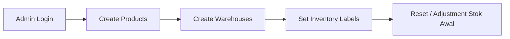
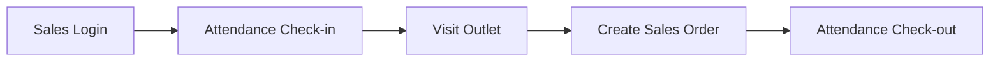
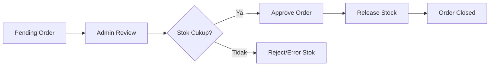
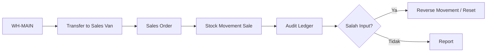

# YukSales — API Routes & Business Flow

## Overview

YukSales saat ini adalah platform **multi-company / multi-tenant** untuk:

- sales tracking lapangan,
- attendance sales,
- visit outlet,
- POS/order penjualan,
- inventory multi-gudang,
- transfer stok,
- reset/reversal stok,
- approval admin,
- laporan ringkas.

Semua route bisnis utama memakai `companyId` dari JWT, jadi data tenant/company tidak bercampur.

Base URL dev biasanya:

```txt
http://localhost:<API_PORT>
```

Auth header untuk protected route:

```txt
Authorization: Bearer <accessToken>
```

---

## Auth & Session

### `POST /auth/login`

Login memakai email / phone / employee code.

Body:

```json
{
  "identifier": "admin@yuksales.local",
  "password": "ChangeMe123!",
  "deviceId": "device-uuid-or-string"
}
```

Return:

- `accessToken`,
- `refreshToken`,
- user profile,
- company info.

Business flow:

1. User login.
2. API validasi password.
3. API buat refresh session.
4. Frontend menyimpan token.
5. Semua request tenant memakai `companyId` dari token.

### `POST /auth/refresh`

Refresh access token.

Body:

```json
{
  "refreshToken": "..."
}
```

### `POST /auth/logout`

Revoke refresh token.

Body optional:

```json
{
  "refreshToken": "..."
}
```

### `GET /auth/me`

Ambil profile user aktif + permissions.

Permission: authenticated user.

---

## Access Control

### `GET /roles`

Melihat daftar role.

Permission: `roles.manage`

### `GET /permissions`

Melihat daftar permission.

Permission: `permissions.manage`

### `POST /permissions`

Membuat permission baru.

Permission: `permissions.manage`

### `GET /roles/:roleId/permissions`

Melihat permission pada role tertentu.

Permission: `roles.manage`

### `POST /roles/:roleId/permissions`

Assign permission ke role.

Permission: `roles.manage`

Business flow:

1. Admin mengelola permission.
2. Role diberi permission.
3. User dengan role tersebut bisa akses fitur sesuai permission.

---

## Attendance Sales

### `GET /attendance/today`

Ambil status absensi hari ini.

Permission: `attendance.execute`

### `POST /attendance/check-in`

Check-in sales.

Permission: `attendance.execute`

Fungsional:

- GPS check-in,
- face/photo capture jika dikirim,
- mulai attendance session.

### `POST /attendance/check-out`

Check-out sales.

Permission: `attendance.execute`

Fungsional:

- GPS check-out,
- menutup attendance session.

### `GET /attendance/review`

Admin review absensi.

Permission: `attendance.review`

Business flow:

1. Sales login dari mobile/PWA.
2. Sales check-in dengan GPS/face capture.
3. Sales melakukan visit/outlet/order.
4. Sales check-out.
5. Admin review attendance.

---

## Visit / Outlet Tracking

### `GET /visits/today`

Ambil daftar visit hari ini untuk sales.

Permission: `visits.execute`

### `POST /visits/check-in`

Check-in ke outlet.

Permission: `visits.execute`

Fungsional:

- validasi outlet,
- GPS/geofence check,
- mulai visit session.

### `GET /visits/review`

Admin review kunjungan sales.

Permission: `visits.review`

Business flow:

1. Sales melihat rute/visit hari ini.
2. Sales check-in outlet.
3. Sistem menyimpan GPS dan visit session.
4. Admin melihat review visit.

---

## Products

### `GET /products`

List produk tenant.

Permission: `sales.view`

### `POST /products`

Membuat / upsert produk.

Permission: `products.manage`

Body umum:

```json
{
  "sku": "YKS-KP-001",
  "name": "Kopi Robusta 250gr",
  "description": "Produk kopi retail",
  "unit": "pack",
  "priceDefault": "35000.00",
  "status": "active"
}
```

Business flow:

1. Admin membuat master produk.
2. Produk masuk inventory balance.
3. Produk dipakai di sales order dan transfer stok.

---

## Inventory / Warehouse

Semua route inventory memakai permission:

```txt
inventory.manage
```

### Settings Label Inventory

#### `GET /inventory/settings`

Ambil label inventory per company/tenant.

Return menyertakan:

```json
{
  "labels": {},
  "scope": { "companyId": "uuid" }
}
```

#### `PUT /inventory/settings`

Update label inventory per tenant.

Body contoh:

```json
{
  "mainWarehouseLabel": "Pusat Stok",
  "transferOutLabel": "Kirim Keluar",
  "transferInLabel": "Terima Masuk"
}
```

Catatan:

- Disimpan dengan key `inventory_labels:<companyId>`.
- Tidak bentrok antar company.

---

### Warehouse

#### `GET /inventory/warehouses`

List warehouse tenant.

Return juga menyertakan `warehouseTypeLabel`.

#### `POST /inventory/warehouses`

Create/upsert warehouse.

Body:

```json
{
  "code": "WH-MAIN",
  "name": "Gudang Utama",
  "address": "Alamat gudang",
  "type": "main",
  "ownerUserId": "uuid-optional",
  "outletId": "uuid-optional"
}
```

Warehouse type:

```txt
main
sales_van
outlet_consignment
```

#### `PATCH /inventory/warehouses/:id`

Update warehouse.

Body partial:

```json
{
  "name": "Gudang Baru",
  "address": "Alamat baru"
}
```

#### `DELETE /inventory/warehouses/:id`

Soft delete / deactivate warehouse.

Behavior:

- Set `status = inactive`.
- Tidak bisa deactivate jika masih ada `quantity > 0` atau `reservedQuantity > 0`.

Business flow warehouse:

1. Admin membuat warehouse pusat / sales van / outlet consignment.
2. Stok ditempatkan per warehouse.
3. Warehouse aktif dipakai untuk transfer/order.
4. Warehouse hanya bisa dinonaktifkan jika kosong.

---

### Stock Balance & Movement

#### `GET /inventory/balances`

List stok per warehouse dan produk.

Query optional:

```txt
?warehouseId=<uuid>&productId=<uuid>
```

Return:

- warehouse info,
- product info,
- `quantity`,
- `reservedQuantity`,
- `warehouseTypeLabel`.

#### `GET /inventory/movements`

List ledger movement stok.

Return:

- movement type,
- quantity delta,
- reference type/id,
- custom movement label,
- direction label.

Movement type yang dipakai:

```txt
adjustment
transfer_in
transfer_out
sale
return
```

Reference type yang dipakai:

```txt
stock_adjustment
stock_reset
stock_transfer
movement_reversal
sales_transaction
```

---

### Stock Adjustment

#### `POST /inventory/adjustments`

Menambah/mengurangi stok manual.

Body:

```json
{
  "warehouseId": "uuid",
  "productId": "uuid",
  "quantityDelta": "10",
  "notes": "Penyesuaian stok opname"
}
```

Behavior:

- delta positif menambah stok,
- delta negatif mengurangi stok,
- reject jika menyebabkan stok negatif,
- tulis movement `adjustment`,
- tulis audit log.

---

### Stock Reset

#### `POST /inventory/resets`

Reset stok ke target quantity.

Body:

```json
{
  "warehouseId": "uuid",
  "productId": "uuid",
  "targetQuantity": "25",
  "notes": "Stock opname akhir bulan"
}
```

Behavior:

- hitung delta dari stok sekarang ke target,
- update balance,
- tulis movement `adjustment`,
- `referenceType = stock_reset`,
- tulis audit log.

---

### Movement Reversal / Pembatalan

#### `POST /inventory/movements/:id/reverse`

Membatalkan movement dengan transaksi pembalik.

Body:

```json
{
  "notes": "Batalkan input salah"
}
```

Behavior:

- movement lama tidak dihapus,
- sistem buat movement baru dengan delta kebalikan,
- `referenceType = movement_reversal`,
- `referenceId = original movement id`,
- mencegah reversal ganda,
- reject jika reversal menyebabkan stok negatif,
- tulis audit log.

---

### Stock Transfer

#### `POST /inventory/transfers`

Transfer stok antar warehouse.

Body:

```json
{
  "fromWarehouseId": "uuid",
  "toWarehouseId": "uuid",
  "notes": "Kirim stok ke sales van",
  "items": [
    {
      "productId": "uuid",
      "quantity": "2"
    }
  ]
}
```

Return:

```json
{
  "success": true,
  "transferReferenceId": "uuid"
}
```

Behavior:

- source dan destination tidak boleh sama,
- source harus punya stok cukup,
- kurangi stok source,
- tambah stok destination,
- tulis movement `transfer_out` dan `transfer_in`,
- dua movement memakai `referenceId` yang sama,
- tulis audit log.

Business flow inventory:

1. Admin membuat warehouse dan produk.
2. Admin set stok awal via adjustment/reset.
3. Admin transfer stok dari `WH-MAIN` ke `WH-SALES` atau outlet.
4. Sales order memakai source warehouse.
5. Approval sales mengurangi stok dari source warehouse.
6. Jika salah input, admin memakai reversal/reset.
7. Semua perubahan masuk ledger movement dan audit log.

---

## Sales Order / POS

### `GET /sales/orders`

List sales orders tenant.

Permission: `sales.view`

### `POST /sales/orders`

Membuat order penjualan.

Permission: `sales.order.create`

Body:

```json
{
  "outletId": "uuid-optional",
  "sourceWarehouseId": "uuid-optional",
  "customerType": "store",
  "paymentMethod": "cash",
  "clientRequestId": "uuid",
  "items": [
    {
      "productId": "uuid",
      "quantity": "1",
      "unitPrice": "35000"
    }
  ]
}
```

Customer type:

```txt
store
agent
end_user
```

Payment method:

```txt
cash
qris
consignment
```

Behavior:

- idempotent by `clientRequestId`,
- membuat sales transaction,
- membuat transaction items,
- status awal `pending_approval`,
- cash/qris otomatis `paid`, consignment `unpaid`.

### `POST /sales/orders/:id/approve`

Admin approve order.

Permission: `sales.order.review`

Behavior:

- cek order tenant,
- pakai `sourceWarehouseId` jika ada,
- fallback ke `WH-MAIN`,
- validasi stok cukup,
- kurangi stok,
- tulis movement `sale`,
- update order menjadi `closed`.

Business flow sales:

1. Sales membuat order dari outlet/customer.
2. Order masuk status `pending_approval`.
3. Admin review dan approve.
4. Sistem release stok dari warehouse sumber.
5. Order closed.
6. Movement stok tercatat.

---

## Reports

### `GET /reports/summary`

Ringkasan report admin.

Permission: `reports.view`

Fungsional:

- summary sales,
- aktivitas / statistik ringkas sesuai implementasi report saat ini.

---

## Planned / Placeholder Routes

Route berikut sudah terdaftar tetapi masih `planned`:

### `GET /settings`

Module planned: settings.

### `GET /outlets`

Module planned: outlets.

### `GET /transactions`

Module planned: transactions.

### `GET /sync/status`

Module planned: sync.

---

## Business Flow Utama End-to-End

### 1. Admin Setup Tenant



### 2. Sales Daily Operation



### 3. Admin Sales Approval



### 4. Inventory Control



---

## Permission Map Ringkas

| Permission | Fungsi |
|---|---|
| `attendance.execute` | Sales check-in/check-out attendance |
| `attendance.review` | Admin review attendance |
| `visits.execute` | Sales visit/check-in outlet |
| `visits.review` | Admin review visits |
| `sales.view` | Lihat produk/order sales |
| `sales.order.create` | Buat sales order |
| `sales.order.review` | Approve sales order |
| `products.manage` | Kelola produk |
| `inventory.manage` | Kelola warehouse, stok, transfer, reset, reversal |
| `reports.view` | Lihat laporan |
| `roles.manage` | Kelola role permission |
| `permissions.manage` | Kelola master permission |
| `receivables.view` | Akses piutang |
| `invoice.review` | Review invoice/nota |

---

## Catatan Teknis

- Multi-tenant isolation memakai `companyId` dari JWT.
- Inventory label custom disimpan per company dengan key `inventory_labels:<companyId>`.
- Warehouse delete adalah soft-delete (`status = inactive`).
- Warehouse tidak bisa inactive kalau masih ada stok/reserved.
- Movement inventory tidak dihapus; pembatalan memakai reversal movement.
- Transfer stok memakai `transferReferenceId` untuk mengikat `transfer_out` dan `transfer_in`.
