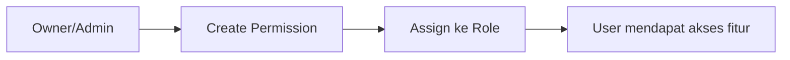
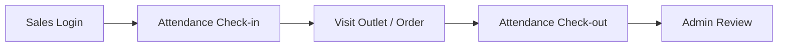
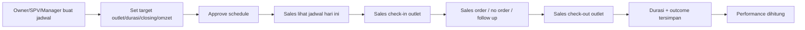
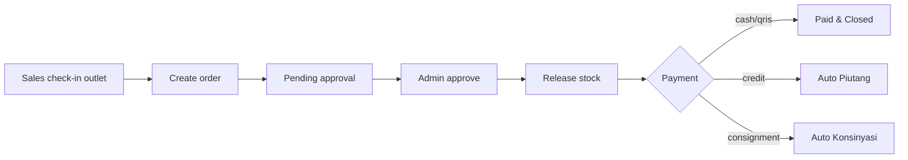
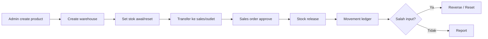
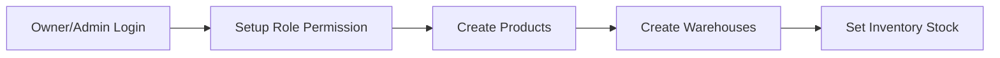
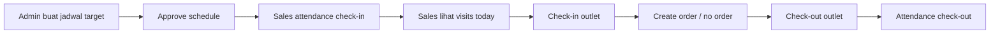
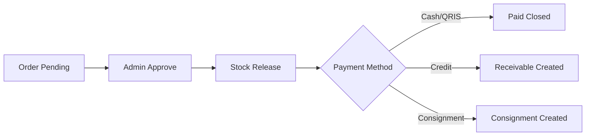
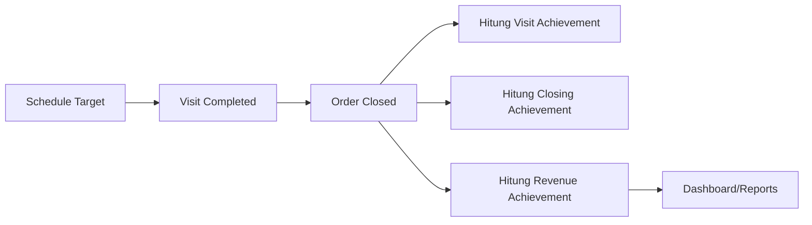

# YukSales — API Routes, Functional Scope & Business Flow

## Overview

YukSales adalah sistem **multi-company / multi-tenant** untuk:

- sales tracking lapangan,
- attendance sales,
- penjadwalan kunjungan sales ke outlet,
- target outlet, durasi, closing transaksi, dan omzet,
- check-in/check-out outlet dengan geofence,
- POS/order penjualan,
- piutang tempo,
- konsinyasi,
- inventory multi-gudang,
- transfer, reset, reversal stok,
- admin approval dan reporting.

Sebagian besar route bisnis mengambil `companyId` dari JWT, sehingga data antar company/tenant terisolasi.

Auth header:

```txt
Authorization: Bearer <accessToken>
```

---

## 1. Auth & Session

### `POST /auth/login`

Login user memakai email/phone/employee code.

Body:

```json
{
  "identifier": "admin@yuksales.local",
  "password": "ChangeMe123!",
  "deviceId": "device-id"
}
```

Fungsi:

- validasi credential,
- membuat access token,
- membuat refresh token,
- mengembalikan profile user dan company.

### `POST /auth/refresh`

Refresh access token.

### `POST /auth/logout`

Logout dan revoke refresh token.

### `GET /auth/me`

Ambil user aktif dan permission.

---

## 2. Access Control

### `GET /roles`

Permission: `roles.manage`

Melihat daftar role.

### `GET /permissions`

Permission: `permissions.manage`

Melihat daftar permission.

### `POST /permissions`

Permission: `permissions.manage`

Membuat permission baru.

### `GET /roles/:roleId/permissions`

Permission: `roles.manage`

Melihat permission role tertentu.

### `POST /roles/:roleId/permissions`

Permission: `roles.manage`

Assign permission ke role.

Business flow:



---

## 3. Attendance Sales

### `GET /attendance/today`

Permission: `attendance.execute`

Ambil status absensi sales hari ini.

### `POST /attendance/check-in`

Permission: `attendance.execute`

Sales check-in kerja harian.

Fungsi:

- simpan waktu check-in,
- simpan lokasi GPS,
- dukung face capture/media bila dikirim,
- membuka attendance session.

### `POST /attendance/check-out`

Permission: `attendance.execute`

Sales check-out kerja harian.

Fungsi:

- simpan waktu check-out,
- simpan lokasi GPS,
- menghitung durasi attendance.

### `GET /attendance/review`

Permission: `attendance.review`

Admin/SPV/manager review attendance sales.

Business flow:



---

## 4. Visit Scheduling & Outlet Attendance

### `GET /visits/schedules`

Permission: `visits.review`

Melihat jadwal kunjungan sales.

Query optional:

```txt
?date=2026-04-30&salesUserId=<uuid>
```

### `POST /visits/schedules`

Permission: `visits.review`

Admin/SPV/manager membuat jadwal kunjungan sales ke outlet.

Body contoh:

```json
{
  "salesUserId": "uuid-sales",
  "outletIds": ["uuid-outlet-1", "uuid-outlet-2"],
  "scheduledDate": "2026-04-30",
  "plannedStartTime": "08:00",
  "plannedEndTime": "12:00",
  "targetOutletCount": 2,
  "targetDurationMinutes": 240,
  "targetClosingCount": 1,
  "targetRevenueAmount": "1500000",
  "priority": 2,
  "notes": "Target pagi: 2 outlet, 1 closing, omzet 1.5 juta"
}
```

Fungsi:

- membuat schedule per outlet,
- menentukan sales yang ditugaskan,
- menentukan target jumlah outlet,
- menentukan target durasi,
- menentukan target closing transaksi,
- menentukan target omzet/revenue,
- mengembalikan simulasi target.

Response `simulation`:

```json
{
  "targetOutletCount": 2,
  "scheduledOutletCount": 2,
  "targetDurationMinutes": 240,
  "targetClosingCount": 1,
  "targetRevenueAmount": "1500000",
  "withinTarget": true
}
```

### `PATCH /visits/schedules/:id`

Permission: `visits.review`

Update schedule.

### `POST /visits/schedules/:id/approve`

Permission: `visits.review`

Approve schedule.

Status berubah menjadi:

```txt
approved
```

### `POST /visits/schedules/:id/cancel`

Permission: `visits.review`

Cancel schedule.

Status schedule:

```txt
draft
assigned
approved
in_progress
completed
missed
cancelled
```

---

### `GET /visits/today`

Permission: `visits.execute`

Sales melihat jadwal hari ini.

Fungsi:

- jika ada schedule hari ini, return schedule dan target,
- jika belum ada schedule, fallback ke list outlet aktif.

Target yang dikirim:

```json
{
  "outletCount": 5,
  "scheduledOutletCount": 5,
  "targetDurationMinutes": 240,
  "targetClosingCount": 3,
  "targetRevenueAmount": "5000000.00"
}
```

### `POST /visits/check-in`

Permission: `visits.execute`

Sales check-in outlet.

Body:

```json
{
  "outletId": "uuid-outlet",
  "scheduleId": "uuid-schedule-optional",
  "clientRequestId": "uuid-request",
  "latitude": -7.250445,
  "longitude": 112.768845,
  "accuracyM": 8
}
```

Fungsi:

- validasi outlet tenant,
- validasi schedule milik sales,
- validasi outlet sesuai schedule,
- hitung distance GPS ke outlet,
- validasi geofence,
- membuat `visitSession`,
- schedule berubah menjadi `in_progress`.

### `POST /visits/check-out`

Permission: `visits.execute`

Sales check-out outlet dan menutup kunjungan.

Body:

```json
{
  "visitSessionId": "uuid-visit",
  "latitude": -7.250445,
  "longitude": 112.768845,
  "accuracyM": 8,
  "outcome": "closed_order",
  "closingNotes": "Closing kredit Rp 1.500.000"
}
```

Outcome:

```txt
closed_order
no_order
follow_up
outlet_closed
rejected
invalid_location
```

Fungsi:

- simpan waktu check-out,
- hitung `durationSeconds`,
- simpan outcome/closing notes,
- cek apakah ada order terkait visit,
- schedule berubah menjadi `completed`.

### `GET /visits/performance`

Permission: `visits.review`

Menghitung performance kunjungan dan closing.

Query:

```txt
?from=2026-04-30&to=2026-04-30&salesUserId=<uuid>
```

Return metric:

```json
{
  "scheduledOutletCount": 5,
  "completedOutletCount": 5,
  "targetOutletCount": 5,
  "visitAchievementPercent": 100,
  "targetClosingCount": 3,
  "actualClosingCount": 2,
  "closingAchievementPercent": 67,
  "targetRevenueAmount": "5000000.00",
  "actualRevenueAmount": "3500000.00",
  "revenueAchievementPercent": 70,
  "effectiveCallRate": 40,
  "averageOrderValue": "1750000.00"
}
```

### `GET /visits/review`

Permission: `visits.review`

Review semua visit session terbaru.

Business flow visit:



---

## 5. Products

### `GET /products`

Permission: `sales.view`

List produk tenant.

### `POST /products`

Permission: `products.manage`

Create/upsert produk.

Body:

```json
{
  "sku": "SKU-001",
  "name": "Kopi Robusta 250gr",
  "description": "Produk retail",
  "unit": "pack",
  "priceDefault": "35000",
  "status": "active"
}
```

---

## 6. Sales Order / POS

### `GET /sales/orders`

Permission: `sales.view`

List sales order tenant.

### `POST /sales/orders`

Permission: `sales.order.create`

Membuat order penjualan.

Body:

```json
{
  "outletId": "uuid-outlet",
  "visitSessionId": "uuid-visit-session",
  "sourceWarehouseId": "uuid-warehouse-optional",
  "customerType": "store",
  "paymentMethod": "credit",
  "clientRequestId": "uuid-request",
  "items": [
    {
      "productId": "uuid-product",
      "quantity": "2",
      "unitPrice": "35000"
    }
  ]
}
```

Customer type:

```txt
store
agent
end_user
```

Payment method:

```txt
cash
qris
credit
consignment
```

Fungsi:

- idempotent via `clientRequestId`,
- order bisa terhubung ke visit session,
- validasi visit milik sales login,
- validasi visit masih `open`,
- validasi outlet order sama dengan outlet visit,
- status awal `pending_approval`,
- cash/qris dianggap `paid`,
- credit/consignment dianggap `unpaid`.

### `POST /sales/orders/:id/approve`

Permission: `sales.order.review`

Approve order oleh admin.

Fungsi:

- validasi order tenant,
- menentukan warehouse sumber,
- validasi stok cukup,
- release stok,
- tulis inventory movement `sale`,
- order berubah menjadi `closed`,
- jika `paymentMethod = credit`, otomatis buat piutang,
- jika `paymentMethod = consignment`, otomatis buat consignment dan item.

Business flow sales/POS:



---

## 7. Receivables / Piutang

### `GET /receivables`

Permission: `receivables.view`

List piutang.

Piutang otomatis dibuat ketika order `credit` di-approve.

Status:

```txt
open
partial
paid
overdue
written_off
```

### `POST /receivables/:id/payments`

Permission: `receivables.view`

Catat pembayaran piutang.

Body:

```json
{
  "amount": "500000",
  "paymentMethod": "cash",
  "paidAt": "2026-04-30T10:00:00.000Z",
  "notes": "Bayar sebagian"
}
```

Fungsi:

- tambah payment record,
- update paid amount,
- update outstanding amount,
- status menjadi `partial` atau `paid`.

---

## 8. Consignments / Konsinyasi

### `GET /consignments`

Permission: `receivables.view`

List konsinyasi.

Konsinyasi otomatis dibuat ketika order `consignment` di-approve.

Status:

```txt
active
paid
overdue
withdrawal_required
withdrawn
extended
reset_stock
```

### `POST /consignments/:id/actions`

Permission: `receivables.view`

Aksi konsinyasi.

Body:

```json
{
  "actionType": "notify_withdrawal",
  "notes": "Produk belum laku, jadwalkan penarikan"
}
```

Action type:

```txt
notify_withdrawal
extend
withdraw
reset_stock_zero
```

---

## 9. Inventory / Warehouse

Semua inventory route memakai permission:

```txt
inventory.manage
```

### `GET /inventory/settings`

Ambil custom label inventory tenant.

### `PUT /inventory/settings`

Update custom label inventory tenant.

Label disimpan per company:

```txt
inventory_labels:<companyId>
```

Label yang bisa diubah:

```txt
warehouseCodePrefix
mainWarehouseLabel
salesWarehouseLabel
outletConsignmentLabel
transferOutLabel
transferInLabel
saleLabel
returnLabel
adjustmentLabel
stockResetLabel
movementReversalLabel
```

### `GET /inventory/warehouses`

List warehouse.

### `POST /inventory/warehouses`

Create/upsert warehouse.

Warehouse type:

```txt
main
sales_van
outlet_consignment
```

### `PATCH /inventory/warehouses/:id`

Update warehouse.

### `DELETE /inventory/warehouses/:id`

Soft delete/deactivate warehouse.

Guard:

- tidak bisa deactivate jika masih ada stok,
- tidak bisa deactivate jika masih ada reserved stock.

### `GET /inventory/balances`

List stock balance per warehouse/product.

Query optional:

```txt
?warehouseId=<uuid>&productId=<uuid>
```

### `GET /inventory/movements`

List ledger movement stok.

### `POST /inventory/adjustments`

Adjustment stok manual.

Body:

```json
{
  "warehouseId": "uuid-warehouse",
  "productId": "uuid-product",
  "quantityDelta": "10",
  "notes": "Stok awal"
}
```

### `POST /inventory/resets`

Reset stok ke target quantity.

Body:

```json
{
  "warehouseId": "uuid-warehouse",
  "productId": "uuid-product",
  "targetQuantity": "25",
  "notes": "Stock opname"
}
```

### `POST /inventory/movements/:id/reverse`

Membatalkan movement dengan reversal movement.

Fungsi:

- movement lama tidak dihapus,
- membuat movement kebalikan,
- mencegah reversal ganda,
- menjaga stok tidak negatif.

### `POST /inventory/transfers`

Transfer stok antar warehouse.

Body:

```json
{
  "fromWarehouseId": "uuid-source",
  "toWarehouseId": "uuid-destination",
  "notes": "Kirim ke sales van",
  "items": [
    {
      "productId": "uuid-product",
      "quantity": "2"
    }
  ]
}
```

Business flow inventory:



---

## 10. Reports

### `GET /reports/summary`

Permission: `reports.view`

Ringkasan laporan admin.

---

## 11. Planned / Placeholder Routes

Route berikut terdaftar tetapi masih placeholder/planned:

```txt
GET /settings
GET /outlets
GET /transactions
GET /sync/status
```

Catatan: `/outlets` saat ini masih placeholder di registry, walaupun schema outlet sudah ada dan digunakan oleh visit scheduling.

---

## 12. Permission Map

| Permission | Fungsi |
|---|---|
| `attendance.execute` | Sales check-in/check-out kerja |
| `attendance.review` | Review attendance |
| `visits.execute` | Sales lihat jadwal, check-in/check-out outlet |
| `visits.review` | Admin/SPV/manager kelola jadwal dan review visit |
| `sales.view` | Lihat produk/order sales |
| `sales.order.create` | Buat sales order |
| `sales.order.review` | Approve sales order |
| `products.manage` | Kelola produk |
| `inventory.manage` | Kelola inventory/warehouse/stok |
| `receivables.view` | Lihat dan kelola piutang/konsinyasi minimal |
| `reports.view` | Lihat laporan |
| `roles.manage` | Kelola role |
| `permissions.manage` | Kelola permission |

---

## 13. End-to-End Flow Utama

### Setup Master Data



### Daily Sales Operation



### Closing & Finance



### Performance Tracking



---

## 14. Catatan Dev Server

Terakhir `pnpm run dev` sempat gagal karena proses dev `apps/web` gagal dan batch dihentikan manual.
API sempat berhasil listen di:

```txt
http://127.0.0.1:4000
```

Jika perlu investigasi, jalankan terpisah:

```bash
pnpm --filter @yuksales/api dev
pnpm --filter @yuksales/web dev
```

---

## 15. Status Terbaru

Sudah diverifikasi sebelumnya:

```bash
pnpm typecheck
pnpm db:generate
pnpm db:migrate
pnpm build
```

Migration terbaru:

```txt
packages/db/drizzle/0004_fine_goblin_queen.sql
packages/db/drizzle/0005_first_weapon_omega.sql
```
