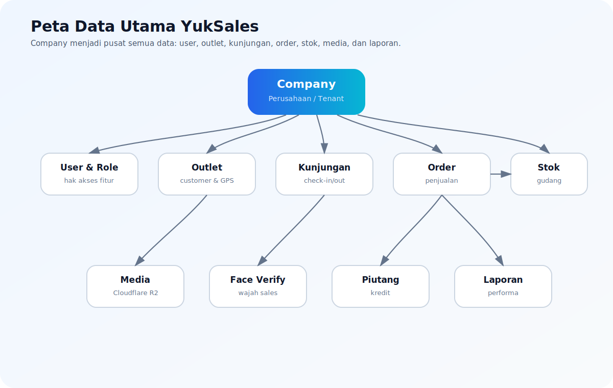
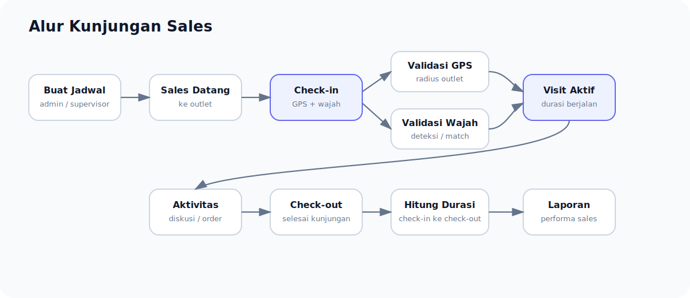
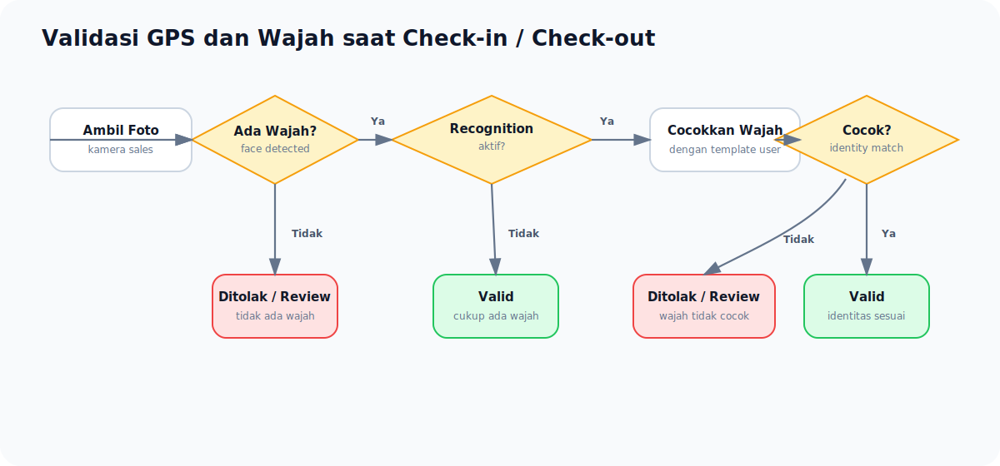
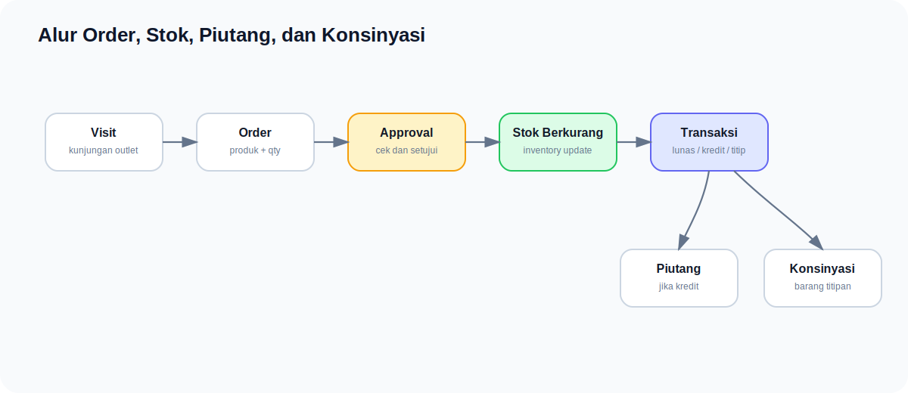

# ERD Bisnis YukSales

Dokumen ini menjelaskan hubungan data YukSales dengan bahasa bisnis yang mudah dipahami.
Tujuannya agar owner, admin, supervisor, sales, dan tim operasional paham **data apa saja yang saling berhubungan** dan **bagaimana alurnya dipakai dalam aktivitas harian**.

> [!NOTE]
> ERD biasanya terlihat teknis. Di dokumen ini, kita jelaskan sebagai alur bisnis: siapa punya apa, data apa yang tercatat, dan kenapa data itu penting untuk operasional dan audit.

---

# Gambaran Besar

YukSales mengelola aktivitas sales lapangan dari awal sampai akhir:

```txt
Company
→ User dan Role
→ Outlet
→ Jadwal Kunjungan
→ Check-in dengan GPS dan wajah
→ Order / Transaksi
→ Stok berkurang
→ Piutang / Konsinyasi jika ada
→ Check-out
→ Laporan performa dan audit
```

Selain itu, sistem juga mendukung:

```txt
Foto / media disimpan di Cloudflare R2
Integrasi per company
Offline sync untuk mobile sales
Audit log agar semua perubahan bisa dilacak
```

---

# Diagram Hubungan Data Utama

Karena preview Markdown yang dipakai tidak merender Mermaid, diagram di bawah dibuat sebagai **gambar SVG** agar tampil langsung sebagai flowchart.

## A. Peta Data Utama



Penjelasan singkat:

```txt
Company menjadi pusat data.
Setiap company punya user, outlet, produk, gudang, setting, dan integrasi sendiri.
Kunjungan menghubungkan sales, outlet, validasi GPS/wajah, order, stok, dan laporan.
```

---

## B. Alur Jadwal dan Realisasi Kunjungan



Penjelasan singkat:

```txt
Jadwal adalah rencana.
Visit session adalah bukti kunjungan benar-benar terjadi.
Check-in memulai durasi kunjungan, check-out mengakhiri durasi.
```

---

## C. Alur Validasi GPS dan Wajah



Penjelasan singkat:

```txt
Jika face recognition tidak aktif, sistem cukup memastikan ada wajah.
Jika face recognition aktif, wajah sales harus cocok dengan template wajah user tersebut.
Jika tidak valid, kunjungan bisa ditolak atau masuk manual review sesuai setting company.
```

---

## D. Alur Order, Stok, Piutang, dan Konsinyasi



Penjelasan singkat:

```txt
Order yang disetujui akan memotong stok.
Jika pembayaran kredit, sistem membuat piutang.
Jika barang titipan, sistem membuat data konsinyasi.
```

---

## E. Ringkasan Relasi Bisnis Paling Penting

| Dari | Ke | Makna Bisnis |
|---|---|---|
| Company | User | Perusahaan memiliki karyawan/pengguna |
| Company | Outlet | Perusahaan memiliki data customer/outlet |
| User | Jadwal | Sales diberi rencana kunjungan |
| Outlet | Jadwal | Outlet menjadi tujuan kunjungan |
| Jadwal | Kunjungan Aktual | Rencana direalisasikan di lapangan |
| Kunjungan | GPS & Wajah | Bukti lokasi dan identitas sales |
| Kunjungan | Order | Kunjungan bisa menghasilkan penjualan |
| Order | Stok | Order approved mengurangi stok |
| Order | Piutang | Order kredit menjadi tagihan |
| Order | Konsinyasi | Order titipan menjadi data konsinyasi |
| Semua aksi penting | Audit Log | Perubahan bisa dilacak |

# 1. Company / Tenant

Company adalah pusat data utama.

Satu company memiliki:

- user
- outlet
- produk
- gudang
- setting umum
- integrasi storage/face/payment
- transaksi
- laporan

Contoh data company:

```txt
Nama perusahaan
Logo
Foto cover
Alamat
Nomor telepon
Email
Titik GPS kantor
NPWP
Website
Timezone
```

## Kenapa penting?

Karena YukSales bersifat multi-company. Artinya:

```txt
Data Company A tidak bercampur dengan Company B
Setiap company bisa punya setting dan integrasi sendiri
Setiap company bisa punya outlet, sales, produk, dan gudang sendiri
```

---

# 2. User, Role, dan Permission

User adalah orang yang memakai sistem.

Contoh user:

- administrator pusat
- owner company
- manager
- supervisor
- admin
- sales

Role menentukan posisi user, sedangkan permission menentukan fitur apa yang boleh diakses.

Contoh:

```txt
Sales boleh check-in kunjungan
Supervisor boleh approve jadwal
Admin boleh kelola outlet
Owner boleh lihat laporan
```

## Logika bisnis

```txt
User login
→ sistem cek role
→ sistem cek permission
→ user hanya bisa mengakses menu yang diizinkan
```

---

# 3. Company Settings

Setting umum company mengatur aturan operasional.

Contoh setting:

```txt
Radius GPS default
Batas akurasi GPS
Apakah foto wajah wajib
Apakah face recognition wajib
Threshold kecocokan wajah
Apakah gagal wajah langsung ditolak atau masuk review
```

## Contoh bisnis

Company A ingin aturan ketat:

```txt
Wajah wajib
Face recognition wajib
Radius GPS 50 meter
Jika wajah tidak cocok, check-in ditolak
```

Company B lebih fleksibel:

```txt
Wajah wajib
Face recognition tidak wajib
Radius GPS 150 meter
Jika lokasi meragukan, masuk manual review
```

---

# 4. Company Integrations

Integrasi adalah koneksi company ke layanan luar.

Contoh:

```txt
Cloudflare R2 untuk penyimpanan foto
Face recognition provider
Payment gateway
Notification provider
```

## Kenapa dipisahkan dari general settings?

Agar lebih rapi.

General settings untuk aturan bisnis.

Integration settings untuk koneksi pihak ketiga.

Contoh:

```txt
Company A pakai Cloudflare R2 bucket sendiri
Company B bisa pakai S3 bucket berbeda
Company C bisa pakai provider face recognition berbeda
```

---

# 5. Media / Asset

Media adalah semua file yang diupload ke sistem.

Contoh media:

- logo company
- foto cover company
- foto outlet
- foto nota
- foto wajah check-in/check-out
- template wajah user
- bukti pembayaran

File fisik disimpan di Cloudflare R2 atau S3-compatible storage.
Database hanya menyimpan metadata.

Metadata mencatat:

```txt
file milik siapa
jenis file
lokasi file/url
ukuran file
waktu capture
siapa yang upload
```

## Logika upload yang ideal

```txt
Client minta upload URL
→ backend membuat signed URL sesuai company
→ client upload langsung ke Cloudflare R2
→ client konfirmasi upload selesai
→ backend menyimpan metadata file
```

## Kenapa tidak disimpan langsung di database?

Karena foto dan media bisa besar.
Jika disimpan di database:

```txt
Database cepat berat
Backup lebih lambat
Sync offline boros
API menjadi lambat
```

Dengan R2/S3:

```txt
Database tetap ringan
File mudah diakses
Lebih siap untuk skala besar
```

---

# 6. Outlet

Outlet adalah toko, agen, atau customer yang dikunjungi sales.

Data outlet mencakup:

```txt
Kode outlet
Nama outlet
Tipe outlet
Nama pemilik
Nomor telepon
Alamat
GPS latitude/longitude
Radius geofence khusus outlet
Status outlet
Foto outlet
```

Status outlet:

```txt
draft
pending_verification
active
rejected
inactive
```

## Flow bisnis outlet

```txt
Admin/Sales membuat outlet
→ isi alamat dan GPS
→ upload foto outlet
→ supervisor/admin verifikasi
→ outlet aktif
→ outlet bisa masuk jadwal kunjungan
```

## Kenapa GPS outlet penting?

GPS outlet digunakan untuk memastikan sales benar-benar berada dekat outlet saat check-in.

Contoh:

```txt
Outlet radius 100 meter
Sales check-in pada jarak 25 meter
→ valid

Sales check-in pada jarak 500 meter
→ invalid/manual review
```

---

# 7. Jadwal Kunjungan

Jadwal kunjungan adalah rencana kerja sales.

Berisi:

```txt
sales yang bertugas
outlet yang dikunjungi
tanggal kunjungan
jam rencana
target outlet
target durasi
target closing
target revenue
prioritas
catatan
```

## Flow bisnis

```txt
Supervisor/Admin membuat jadwal
→ jadwal bisa disetujui
→ sales melihat jadwal hari ini di mobile
→ sales check-in saat sampai outlet
→ sales check-out setelah selesai
```

---

# 8. Visit Session / Realisasi Kunjungan

Visit session adalah bukti real bahwa sales benar-benar melakukan kunjungan.

Data yang tercatat:

```txt
siapa sales-nya
outlet mana yang dikunjungi
waktu check-in
GPS check-in
foto wajah check-in
waktu check-out
GPS check-out
foto wajah check-out
hasil kunjungan
durasi kunjungan
status valid/manual review
```

## Kapan durasi kunjungan mulai dihitung?

Durasi mulai dihitung saat sales melakukan:

```txt
check-in kunjungan
```

Dan selesai saat:

```txt
check-out kunjungan
```

Contoh:

```txt
Check-in: 09:00
Check-out: 09:30
Durasi: 30 menit
```

---

# 9. Validasi GPS dan Wajah

Saat check-in/check-out, sistem mengecek dua hal utama:

```txt
Apakah sales berada di lokasi outlet?
Apakah wajah sales valid?
```

## Flow validasi wajah

```txt
Sales ambil foto
→ sistem cek apakah ada wajah
→ jika tidak ada wajah, check-in bisa ditolak
→ jika ada wajah, cek apakah face recognition aktif
→ jika aktif, cocokkan dengan template wajah user
→ jika cocok, valid
→ jika tidak cocok, reject atau manual review sesuai setting company
```

## Mode validasi

### Mode ringan

```txt
Foto wajah wajib
Cukup cek ada wajah atau tidak
Tidak perlu cocokkan identitas
```

### Mode ketat

```txt
Foto wajah wajib
Face recognition wajib
Wajah harus cocok dengan user login
```

---

# 10. Face Template

Face template adalah referensi wajah user.

Contoh:

```txt
Admin enroll wajah Sales A
→ foto/template disimpan
→ setiap check-in Sales A dicocokkan dengan template ini
```

Template disimpan per:

```txt
company
user
role
```

Agar wajah user dari company lain tidak bisa dipakai silang.

---

# 11. Sales Transaction / Order

Transaksi sales adalah hasil penjualan dari kunjungan.

Data transaksi mencakup:

```txt
outlet
sales
visit session
warehouse
metode pembayaran
status pembayaran
total transaksi
item produk
qty
harga
diskon
```

## Flow bisnis order

```txt
Sales mengunjungi outlet
→ outlet melakukan order
→ sales input item produk
→ order dibuat
→ supervisor/admin approve
→ stok berkurang
→ jika kredit, piutang dibuat
→ jika konsinyasi, data konsinyasi dibuat
```

---

# 12. Produk, Gudang, dan Stok

Produk adalah barang yang dijual.

Gudang adalah tempat stok disimpan.

Saldo stok menunjukkan jumlah produk di gudang.

Pergerakan stok mencatat semua perubahan stok.

Contoh pergerakan:

```txt
stok masuk
stok keluar karena penjualan
adjustment
transfer antar gudang
reset stok
reversal/koreksi
```

## Kenapa inventory movement penting?

Agar setiap perubahan stok bisa dijelaskan.

Contoh:

```txt
Stok Produk A awal 100
Order approved qty 5
Stok akhir 95
Movement mencatat pengurangan 5 karena order
```

---

# 13. Piutang

Piutang muncul jika transaksi dilakukan secara kredit.

Data piutang mencatat:

```txt
nilai tagihan
nilai sudah dibayar
sisa tagihan
status piutang
riwayat pembayaran
```

Status contoh:

```txt
unpaid
partial
paid
```

## Flow bisnis

```txt
Order kredit approved
→ sistem membuat piutang
→ customer bayar sebagian/lunas
→ admin input pembayaran
→ outstanding berkurang
```

---

# 14. Konsinyasi

Konsinyasi adalah barang titipan di outlet.

Data konsinyasi mencatat:

```txt
outlet
tanggal mulai
tanggal akhir
barang yang dititipkan
status
aksi lanjutan
```

Aksi konsinyasi:

```txt
notify_withdrawal
extend
withdraw
reset_stock_zero
```

## Flow bisnis

```txt
Barang dititipkan ke outlet
→ sistem mencatat konsinyasi
→ jika periode habis, admin bisa minta penarikan
→ stok bisa direset atau ditarik
```

---

# 15. Absensi

Absensi mencatat kehadiran user/sales secara umum.

Berbeda dengan kunjungan outlet.

Absensi menjawab:

```txt
Sales hari ini masuk kerja atau tidak?
Jam berapa mulai kerja?
Jam berapa selesai kerja?
Lokasinya di mana?
```

Kunjungan menjawab:

```txt
Sales mengunjungi outlet mana?
Berapa lama di outlet?
Apakah ada order?
```

---

# 16. Audit Log

Audit log adalah catatan aktivitas penting di sistem.

Contoh yang dicatat:

```txt
setting diubah
outlet dibuat
outlet diverifikasi
jadwal dibuat
check-in dilakukan
check-out dilakukan
transaksi diapprove
media diupload
integrasi diubah
```

## Kenapa audit log penting?

Untuk menjawab pertanyaan:

```txt
Siapa yang mengubah data?
Kapan diubah?
Apa nilai sebelum dan sesudahnya?
Dari IP/perangkat mana?
```

Ini membuat sistem lebih aman dan audit-friendly.

---

# 17. Offline Sync

Mobile sales bisa bekerja saat offline.

Saat offline:

```txt
Data disimpan di perangkat
Foto disimpan lokal dulu
Event transaksi/check-in masuk antrean
```

Saat online:

```txt
Upload media dulu ke R2
Push event ke server
Server mencatat event sync
Status sync bisa dicek
```

## Kenapa media diupload dulu?

Karena transaksi/check-in sering membutuhkan bukti foto.
Jika foto sudah punya `mediaId` atau `fileUrl`, event sync menjadi lebih ringan dan rapi.

---

# Ringkasan Hubungan Data

| Data | Terhubung Dengan | Arti Bisnis |
|---|---|---|
| Company | User, outlet, produk, gudang, setting | Satu tenant/perusahaan |
| User | Role, jadwal, kunjungan, audit | Orang yang memakai sistem |
| Outlet | Foto, jadwal, kunjungan, transaksi | Customer/toko yang dikunjungi |
| Media | Outlet, wajah, nota, deposit | File/foto pendukung |
| Jadwal | Sales dan outlet | Rencana kunjungan |
| Visit session | Jadwal, outlet, sales, face capture | Bukti realisasi kunjungan |
| Face template | User dan media | Identitas biometrik user |
| Produk | Order dan stok | Barang yang dijual |
| Gudang | Stok dan movement | Lokasi penyimpanan barang |
| Transaksi | Outlet, sales, produk, stok | Penjualan/order |
| Piutang | Transaksi kredit | Tagihan customer |
| Konsinyasi | Transaksi titipan | Barang titipan outlet |
| Audit log | User dan aksi | Riwayat aktivitas penting |
| Sync event | User/device | Antrean data offline |

---

# Kesimpulan Bisnis

Dengan struktur ini, YukSales bisa memastikan:

```txt
Sales bekerja sesuai jadwal
Kunjungan benar-benar terjadi di lokasi outlet
Identitas sales bisa diverifikasi lewat wajah
Order terhubung ke stok
Transaksi kredit otomatis menjadi piutang
Konsinyasi bisa dilacak
Foto dan media tersimpan rapi di Cloudflare R2
Setiap perubahan penting tercatat di audit log
Mobile tetap bisa bekerja saat offline
```

Dengan kata lain, sistem bukan hanya mencatat penjualan, tapi juga membantu memastikan:

```txt
validitas kunjungan
keamanan identitas
kedisiplinan sales
akurasi stok
transparansi transaksi
auditable operation
```
